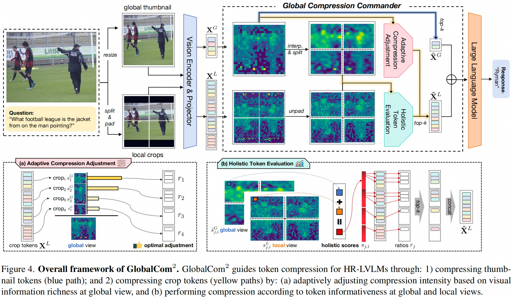
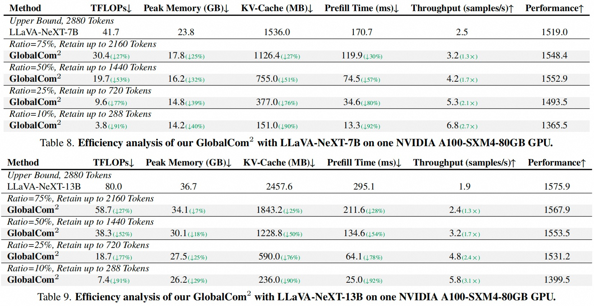
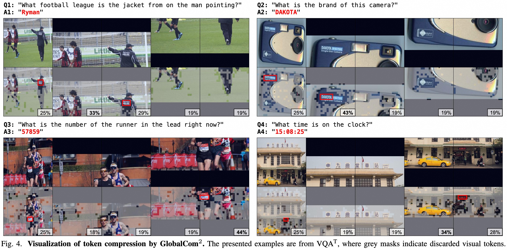

<div align=center>

<h1> 🔎 Global Compression Commander: Plug-and-Play Inference Acceleration for High-Resolution Large Vision-Language Models 🚀 </h1>


<h4 align="center"> 

[Xuyang Liu](https://xuyang-liu16.github.io/)<sup>1</sup>,
Ziming Wang<sup>2</sup>,
[Yuhang Han](https://scholar.google.com/citations?user=zggQZNAAAAAJ)<sup>3</sup>,
[Yingyao Wang](https://scholar.google.com/citations?user=vUExRS0AAAAJ&hl)<sup>2</sup>,
Jiale Yuan<sup>2</sup>,
Jun Song<sup>2✉</sup>,
Bo Zheng<sup>2</sup>, <br>
[Linfeng Zhang](http://www.zhanglinfeng.tech/)<sup>4</sup>,
[Siteng Huang](https://kyonhuang.top/)<sup>5</sup>,
[Honggang Chen](https://sites.google.com/view/honggangchen/)<sup>1✉</sup>

<sup>1</sup>Sichuan University, <sup>2</sup>Taobao & Tmall Group of Alibaba, <br>
<sup>3</sup>Northwest Polytechnical University, <sup>4</sup>Shanghai Jiao Tong University, <sup>5</sup>Zhejiang University

</h4>

</div>

## 🔥 News

* **`2025.11.08`** 🎉🎉 Our [GlobalCom<sup>2</sup>](https://arxiv.org/abs/2501.05179) has been accepted by **AAAI 2026**!
* **`2025.01.10`** 🤗🤗 We release our work [GlobalCom<sup>2</sup>](https://arxiv.org/abs/2501.05179), a "global-to-local" approach for training-free acceleration of **high-resolution LVLMs**. [Code](https://github.com/xuyang-liu16/GlobalCom2) is available!

## ✨ Overview

<p align="center">  </p>

> **TLDR:** We present GlobalCom<sup>2</sup>, a novel plug-and-play token compression method for high-resolution LVLMs that evaluates the information richness of crops from a global perspective to preserve informative regions while removing redundancy.


## 💥 Core Codes

The two key functions in [`llava/model/llava_arch.py`](https://github.com/xuyang-liu16/GlobalCom2/blob/main/llava/model/llava_arch.py) implement our global-guided local compression: **(a)** `generate_scale_for_crop_features` for allocating optimal retention ratios based on each crop's global importance, and **(b)** `interpolate_and_split_cls_attn_scores` for performing token compression with importance from the global perspective.


## 🛠 Preparation

1. Clone this repository.
```bash
git clone https://github.com/xuyang-liu16/GlobalCom2.git
cd GlobalCom2
```

2. Environment Setup and Preparation
```Shell
 conda create -n GlobalCom2 python=3.10 -y
 conda activate GlobalCom2
 pip install -e .
```

3. Download Multimodal Benchmark

Please follow the detailed instruction in [LLaVA-Evaluation](https://github.com/haotian-liu/LLaVA/blob/main/docs/Evaluation.md).


4. Download [LLaVA-NeXT-7B](https://huggingface.co/liuhaotian/llava-v1.6-vicuna-7b) and [LLaVA-NeXT-13B](https://huggingface.co/liuhaotian/llava-v1.6-vicuna-13b) and put them under `./liuhaotian/llava-next-7b` and `./liuhaotian/llava-next-13b`.

> For users with limited access to Hugging Face (e.g., from mainland China), you can refer to this you can refer this [alternative guide](https://cloud.baidu.com/article/3251091) and use the following command, with LLaVA-NeXT-7B as an example:
```
pip install -U huggingface_hub hf_transfer -i https://mirrors.aliyun.com/pypi/simple/
export HF_ENDPOINT=https://hf-mirror.com
huggingface-cli download --resume-download liuhaotian/llava-v1.6-vicuna-7b --local-dir ./liuhaotian/llava-next-7b
```

## 🚀 Evaluation

👉 The only hyper-parameter is `retention_ratio` in line 101 of [`llava/model/llava_arch.py`](https://github.com/xuyang-liu16/GlobalCom2/blob/main/llava/model/llava_arch.py). You can achieve different acceleration effects by setting different `retention_ratio` values (default `retention_ratio = 0.25`).

Example for evaluating TextVQA results:
```
CUDA_VISIBLE_DEVICES=0 bash scripts/v1_5/eval/textvqa.sh
```
Example for evaluating MME results:
```
CUDA_VISIBLE_DEVICES=0 bash scripts/v1_5/eval/mme.sh
```

<p align="center">  </p>

> To calculate the theoretical computational efficiency shown above, we recommend the methodology presented in the work of [LLM-Viewer](https://github.com/hahnyuan/LLM-Viewer/). We deeply appreciate their outstanding contribution to this field.

## 🩻 Visualization

<p align="center">  </p>

> To visualize the compression performance shown above, we recommend utilizing the visualization tools provided in [tools](https://github.com/xuyang-liu16/GlobalCom2/tree/main/tools), which include mask visualization and attention score visualization utilities. We hope these tools will assist in understanding the compression mechanism.


## 📌 Citation

Please consider citing our paper in your publications, if our findings help your research.

```bibtex
@article{Liu2025:GlobalCom,
    title={Compression with Global Guidance: Towards Training-free High-Resolution MLLMs Acceleration}, 
    author={Xuyang Liu and Ziming Wang and Yuhang Han and Yingyao Wang and Jiale Yuan and Jun Song and Bo Zheng and Linfeng Zhang and Siteng Huang and Honggang Chen},
    year={2025},
    eprint={2501.05179},
    archivePrefix={arXiv},
    primaryClass={cs.CV}
}
```


## 👍 Acknowledgment
We extend our gratitude to the open-source efforts of [LLaVA](https://github.com/haotian-liu/LLaVA) and [LLM-Viewer](https://github.com/hahnyuan/LLM-Viewer/).


## 📩 Contact
For any question about our paper or code, please email `liuxuyang@stu.scu.edu.cn`.
