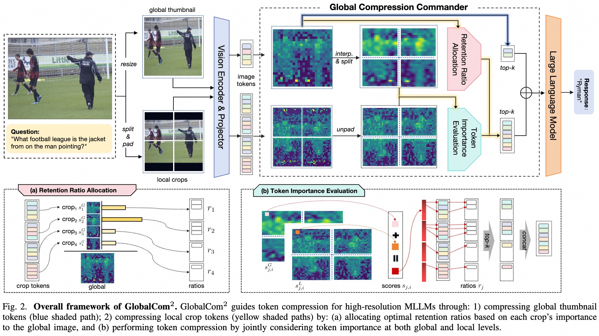

<div align=center>

<h1> 🔎 Compression with Global Guidance: Towards Training-free High-Resolution MLLMs Acceleration 🚀 </h1>


<h4 align="center"> 

[Xuyang Liu](https://xuyang-liu16.github.io/)<sup>1</sup>,
Ziming Wang<sup>2</sup>,
[Yuhang Han](https://scholar.google.com/citations?user=zggQZNAAAAAJ)<sup>3</sup>,
Yingyao Wang<sup>2</sup>,
Jiale Yuan<sup>2</sup>,
Jun Song<sup>2✉</sup>,
Bo Zheng<sup>2</sup>, <br>
[Linfeng Zhang](http://www.zhanglinfeng.tech/)<sup>4</sup>,
[Siteng Huang](https://kyonhuang.top/)<sup>5</sup>,
[Honggang Chen](https://sites.google.com/view/honggangchen/)<sup>1✉</sup>

<sup>1</sup>Sichuan University, <sup>2</sup>Taobao & Tmall Group of Alibaba, <br>
<sup>3</sup>Northeast Forestry University, <sup>4</sup>Shanghai Jiaotong University, <sup>5</sup>Zhejiang University

</h4>

</div>

## 🔥 News

* `2025/01/09` 🤗🤗 We release our latest work GlobalCom<sup>2</sup> about accelerating **high-resolution MLLMs** for FREE. [Code](https://github.com/xuyang-liu16/GlobalCom2) is available!
* `2024/12/24` 🤗🤗 We release an open-sourse repo "[Awesome-Token-Reduction-for-Model-Compression](https://github.com/xuyang-liu16/Awesome-Token-Reduction-for-Model-Compression)", which collects recent awesome token reduction papers! Feel free to contribute your suggestions!

## ✨ Overview
<p align="center">  </p>

In this work, we introduce GlobalCom<sup>2</sup>, an innovative token compression approach specifically designed for high-resolution MLLMs that process both thumbnail and multiple crop inputs. The method uniquely positions thumbnail-derived tokens as the "commander" orchestrating the entire compression process, intelligently guiding retention ratio allocation and precise compression for each crop. This strategic approach effectively eliminates redundant information while adaptively preserving crucial local details to the maximum extent possible. Extensive evaluations across 10 benchmarks demonstrate that GlobalCom<sup>2</sup> achieves an optimal efficiency-performance trade-off, consistently surpassing existing state-of-the-art token compression methods when implemented with LLaVA-NeXT-7B/13B models.


## 🛠 Preparation

1. Clone this repository.
```bash
git clone https://github.com/xuyang-liu16/GlobalCom2.git
cd GlobalCom2
```

2. Environment Setup and Preparation
```Shell
 conda create -n GlobalCom2 python=3.10 -y
 conda activate GlobalCom2
 pip install -e .
```

3. Download Multimodal Benchmark

Please follow the detailed instruction in [LLaVA-Evaluation](https://github.com/haotian-liu/LLaVA/blob/main/docs/Evaluation.md).

4. Download [LLaVA-NeXT-7B](https://huggingface.co/liuhaotian/llava-v1.6-vicuna-7b) and [LLaVA-NeXT-13B](https://huggingface.co/liuhaotian/llava-v1.6-vicuna-13b) and put them under `./liuhaotian/llava-next-7b` and `./liuhaotian/llava-next-13b`.

## 🚀 Evaluation

💥 The only hyper-parameter is `retention ratio` in line 101 of `llava/model/llava_arch.py`. You can achieve different acceleration effects by setting different `retention ratio` values (default `retention ratio = 0.25`).

Example for evaluating TextVQA results:
```Shell
CUDA_VISIBLE_DEVICES=0 bash scripts/v1_5/eval/textvqa.sh
```

To obtain comprehensive theoretical computational efficiency, we recommend the methodology presented in the work of [LLM-viewer](https://github.com/hahnyuan/LLM-Viewer/). We deeply appreciate their outstanding contribution to this field.

## 👍 Acknowledgment

We extend our gratitude to the open-source efforts of [LLaVA](https://github.com/haotian-liu/LLaVA).

## 📩 Contact
For any question about our paper or code, please email `liuxuyang@stu.scu.edu.cn`.
